# Dell Unisphere Mock API Use Cases

This document outlines the primary use cases for the Dell Unisphere Mock API, providing detailed workflows and interaction patterns for developers and testers. These use cases are derived from the API documentation and requirements.

## Table of Contents

- [Authentication and Session Management](#authentication-and-session-management)
- [System Information Retrieval](#system-information-retrieval)
- [Software Version Management](#software-version-management)
- [Software Upgrade Workflow](#software-upgrade-workflow)
- [User Management](#user-management)

## Authentication and Session Management

### UC-1: User Authentication

**Description**: A user authenticates with the API to establish a session.

**Actors**: Client Application, API Server

**Preconditions**:
- The API server is running
- The user has valid credentials

**Flow**:

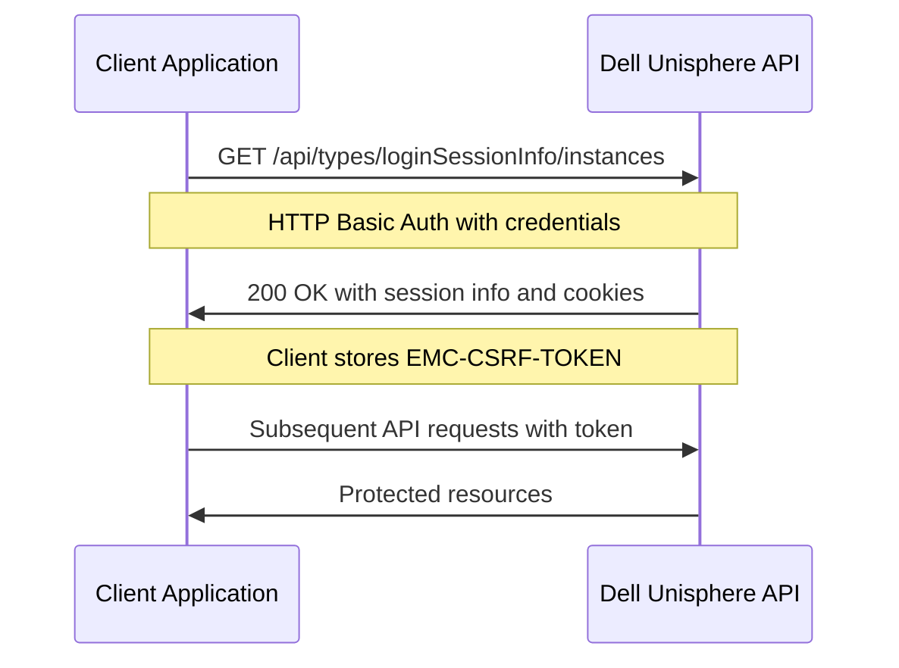

**Postconditions**:
- The user is authenticated
- The client has a valid session cookie and CSRF token
- The client can make authenticated requests

### UC-2: User Logout

**Description**: A user terminates their active session.

**Actors**: Client Application, API Server

**Preconditions**:
- The user has an active authenticated session

**Flow**:

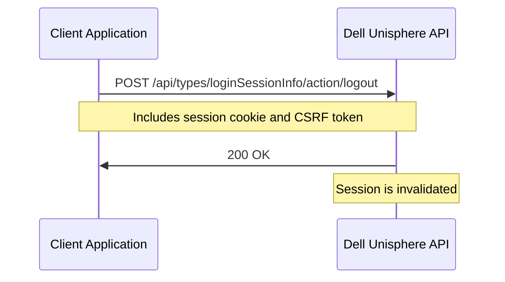

**Postconditions**:
- The user's session is terminated
- The session cookie is invalidated

## System Information Retrieval

### UC-3: Retrieve Basic System Information

**Description**: A client retrieves basic information about the storage system without authentication.

**Actors**: Client Application, API Server

**Preconditions**:
- The API server is running

**Flow**:

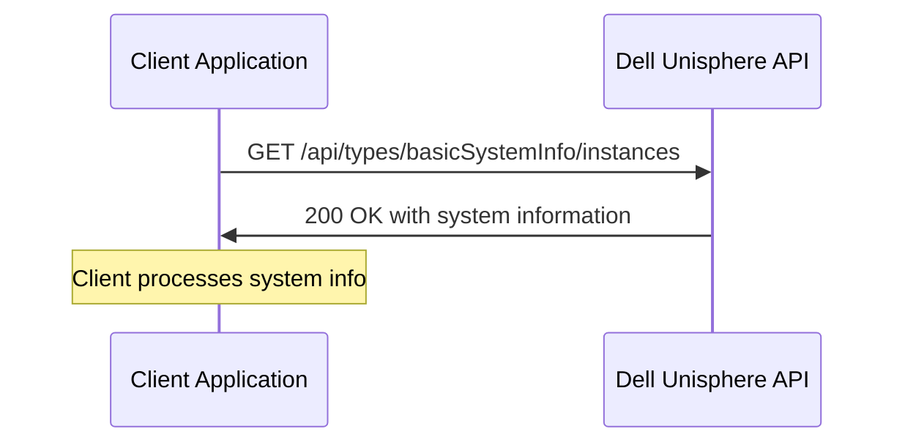

**Postconditions**:
- The client has basic system information (model, name, software version)

## Software Version Management

### UC-4: List Installed Software Versions

**Description**: A user retrieves information about currently installed software.

**Actors**: Client Application, API Server

**Preconditions**:
- The user is authenticated

**Flow**:

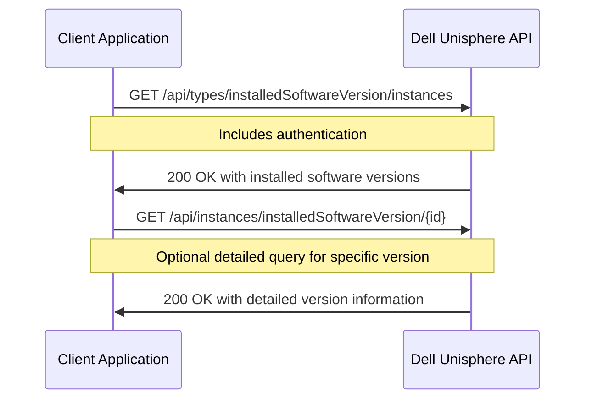

**Postconditions**:
- The client has information about installed software versions

### UC-5: List Candidate Software Versions

**Description**: A user retrieves information about software versions available for upgrade.

**Actors**: Client Application, API Server

**Preconditions**:
- The user is authenticated

**Flow**:

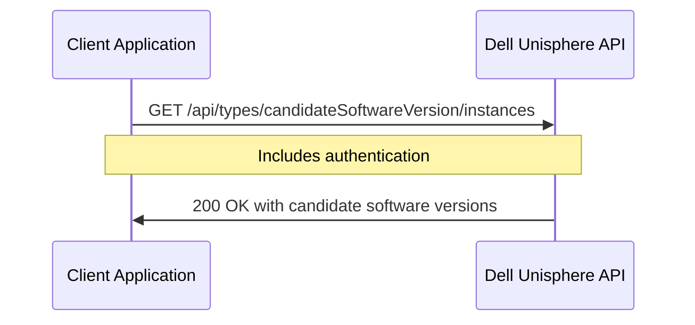

**Postconditions**:
- The client has information about available software versions for upgrade

## Software Upgrade Workflow

### UC-6: Complete Software Upgrade Process

**Description**: A user uploads a new software package and performs a system upgrade.

**Actors**: Client Application, API Server

**Preconditions**:
- The user is authenticated with administrative privileges
- A new software package is available for upload

**Flow**:

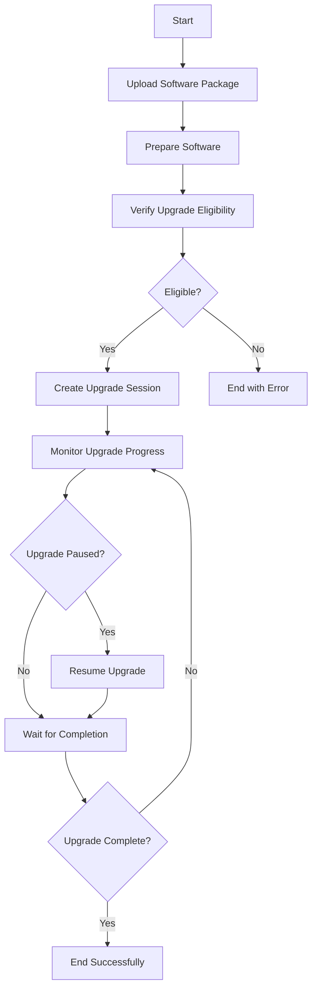

**Detailed Sequence**:

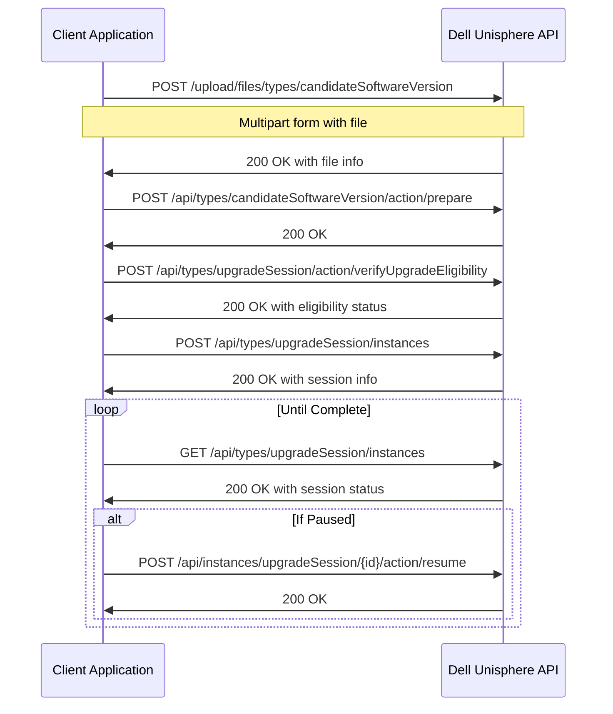

**Postconditions**:
- The new software is installed
- The system is running the updated software version

### UC-7: Upload Software Package

**Description**: A user uploads a new software package to the system.

**Actors**: Client Application, API Server

**Preconditions**:
- The user is authenticated with appropriate privileges
- The user has a valid software package file

**Flow**:

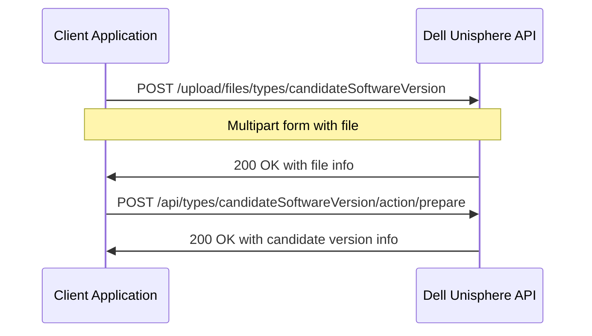

**Postconditions**:
- The software package is uploaded and prepared
- A new candidate software version is available

## User Management

### UC-8: List Users

**Description**: An administrator retrieves information about system users.

**Actors**: Administrator, API Server

**Preconditions**:
- The administrator is authenticated

**Flow**:

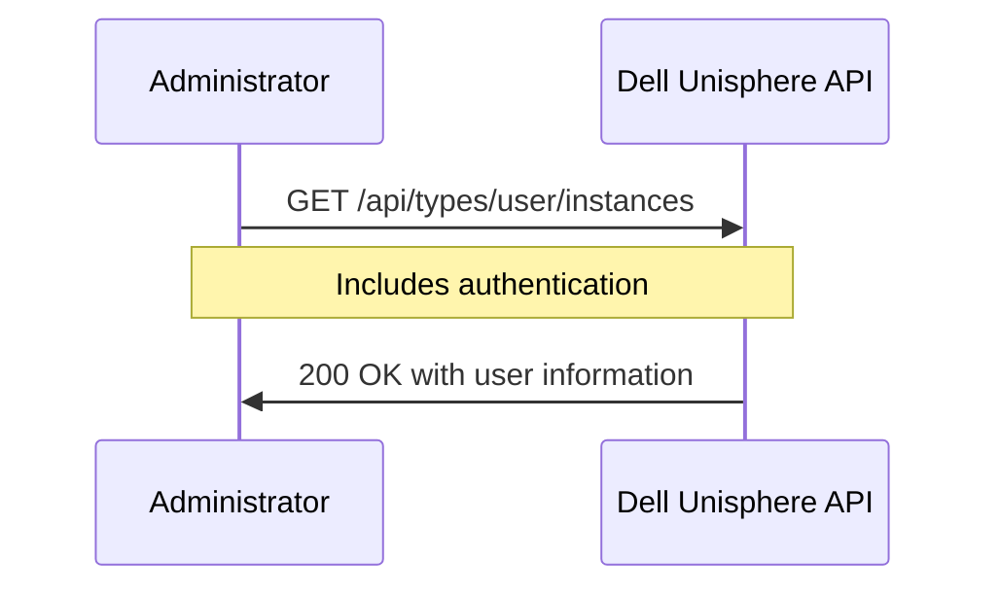

**Postconditions**:
- The administrator has information about system users

## Integration Use Cases

### UC-9: Automated Upgrade Testing

**Description**: A CI/CD pipeline tests the complete upgrade workflow.

**Actors**: CI/CD System, API Server

**Preconditions**:
- The API server is running
- Test credentials are available
- Test software package is available

**Flow**:

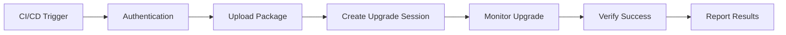

**Postconditions**:
- The upgrade workflow is validated
- Test results are recorded

### UC-10: Client Application Development

**Description**: A developer uses the mock API to build and test a client application.

**Actors**: Developer, Client Application, API Server

**Preconditions**:
- The API server is running
- Development environment is set up

**Flow**:

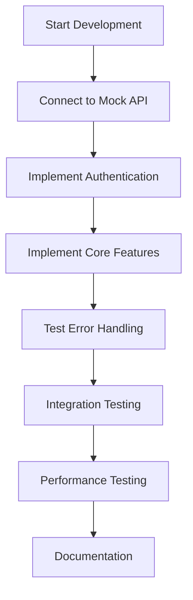

**Postconditions**:
- The client application is developed and tested
- The application can interact with the real Dell Unisphere API

## Error Handling Use Cases

### UC-11: Handle Authentication Failures

**Description**: The system properly handles authentication failures.

**Actors**: Client Application, API Server

**Preconditions**:
- The API server is running

**Flow**:

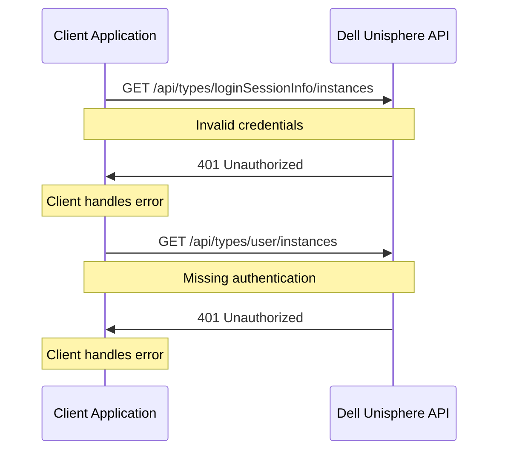

**Postconditions**:
- The system properly rejects unauthorized access
- The client receives appropriate error messages

### UC-12: Handle Invalid Operations

**Description**: The system properly handles invalid operations.

**Actors**: Client Application, API Server

**Preconditions**:
- The user is authenticated

**Flow**:

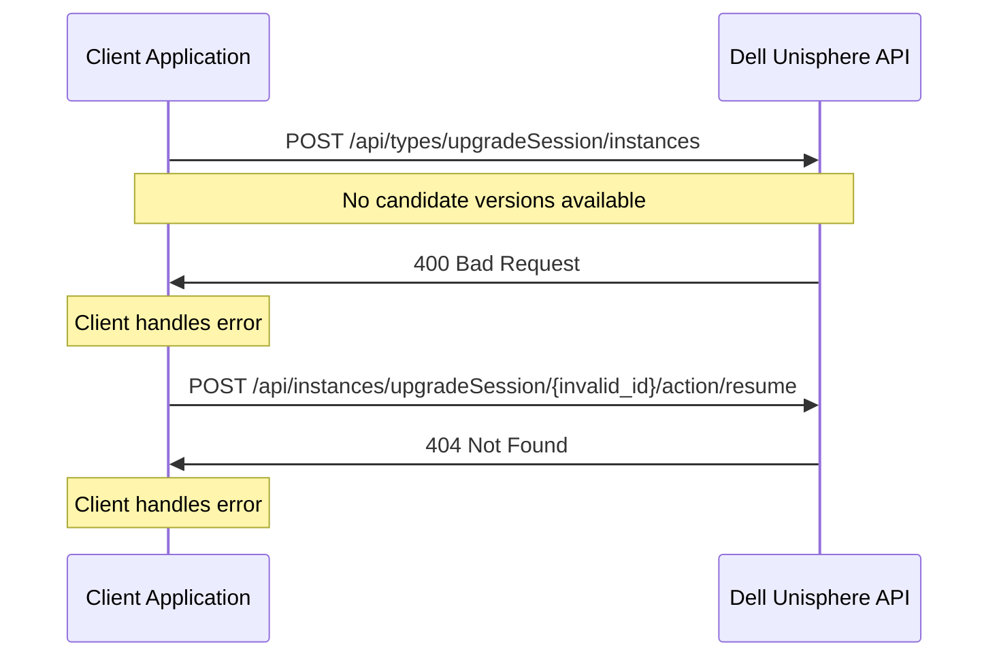

**Postconditions**:
- The system properly rejects invalid operations
- The client receives appropriate error messages

## Security Use Cases

### UC-13: CSRF Protection

**Description**: The system protects against Cross-Site Request Forgery attacks.

**Actors**: Client Application, API Server, Potential Attacker

**Preconditions**:
- The user is authenticated

**Flow**:

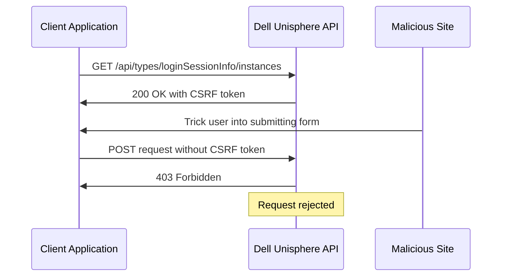

**Postconditions**:
- The system rejects requests without valid CSRF tokens
- The user is protected from CSRF attacks
